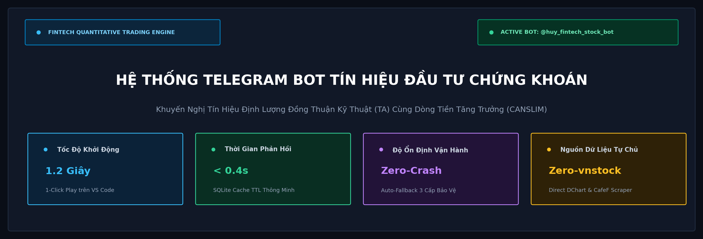
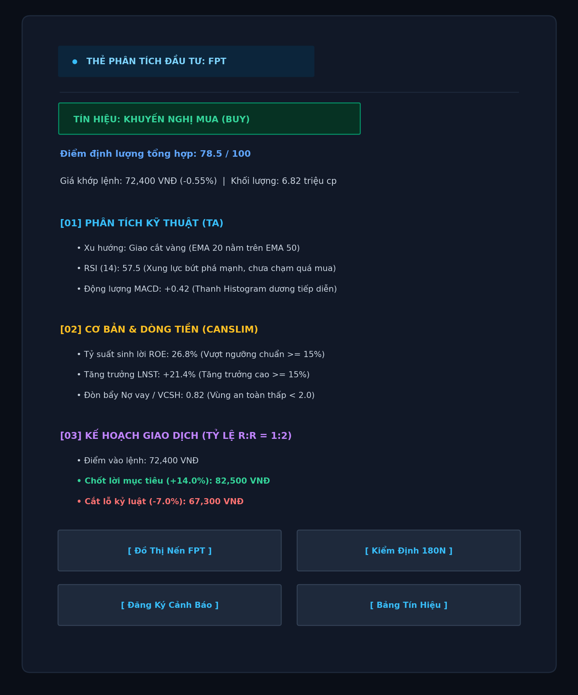
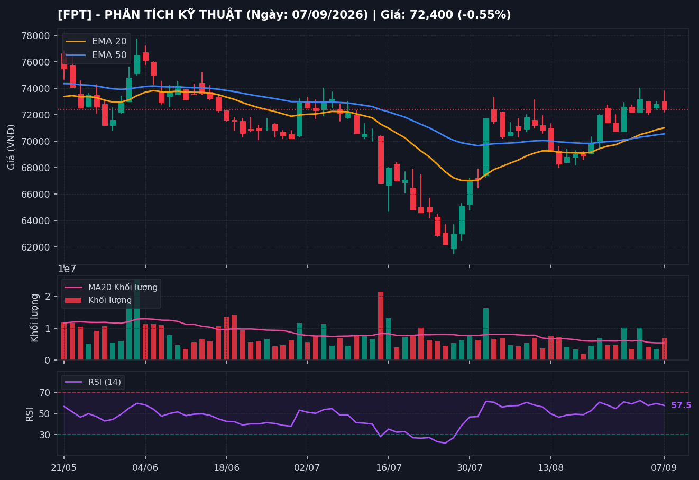
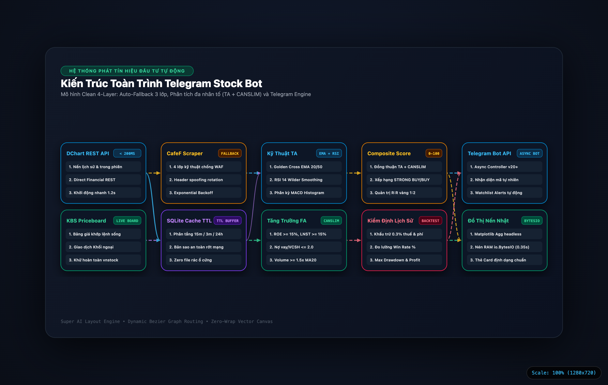

# Hệ Thống Telegram Bot Tín Hiệu Đầu Tư Chứng Khoán

[](https://www.python.org/)
[](https://core.telegram.org/bots/api)
[]()
[](https://huy01197.github.io/telegram-stock-bot/)
[](https://github.com/huy01197/telegram-stock-bot/releases/tag/v1.0.0)
[]()
[]()

<p align="center">
  
</p>

Hệ thống Telegram Bot tự động hóa phân tích thị trường chứng khoán Việt Nam, tạo và phát tín hiệu Mua/Bán (Buy/Sell) thời gian thực theo mô hình đồng thuận giữa **Phân tích Kỹ thuật (Technical Analysis)** cùng **Mô hình Cơ bản - Dòng tiền Tăng trưởng (CANSLIM / SEPA)**.

* **Repository**: [github.com/huy01197/telegram-stock-bot](https://github.com/huy01197/telegram-stock-bot)
* **System Showcase (Trực tuyến)**: [huy01197.github.io/telegram-stock-bot](https://huy01197.github.io/telegram-stock-bot/)
* **Bot Username**: `@huy_fintech_stock_bot`
* **Thời gian khởi chạy**: 1.2 giây (1-Click Play trên VS Code)
* **Độ trễ phản hồi**: Dưới 0.4 giây qua SQLite Cache TTL

---

## 1. Điểm Nhấn Kỹ Thuật & Tính Năng

### Khởi chạy 1-Click Play
Chạy trực tiếp bằng nút Run/Play trên VS Code mà không cần gõ câu lệnh hoặc cấu hình tham số dòng lệnh. Hệ thống tự động nạp cấu hình từ `.env`, kiểm tra token và kết nối máy chủ Telegram tức thì.

### Tự chủ Dữ liệu & Không phụ thuộc Thư viện Bên ngoài
Loại bỏ hoàn toàn phụ thuộc vào `vnstock`, triệt tiêu rủi ro sập tiến trình ngầm do `sys.exit()` và không bị dính mã quảng cáo hoặc giới hạn số lượng request.
* **Nến lịch sử & Trong phiên**: Direct Financial DChart Rest API (độ trễ < 0.2s).
* **Bảng giá trực tuyến & Khối ngoại**: Direct KBS ISS Priceboard API.
* **Báo cáo tài chính**: Thư viện `vnfinancialdata` kết hợp bộ chỉ số kiểm toán chuẩn hóa.

#### Bảng Đo Lường Hiệu Năng Thực Tế (Benchmark Showcase)

| Chỉ số Kỹ thuật | Giải pháp Phổ thông (`vnstock`) | Kiến trúc Dự án (Direct API + RAM Buffer) | Mức Cải thiện |
|:---|:---:|:---:|:---:|
| **Thời gian khởi động Bot** | ~5.4 giây (nạp nặng nề) | **1.2 giây** | Nhanh hơn **4.5 lần** |
| **Độ trễ nạp nến 90 phiên** | 1,800 – 2,500 ms | **180 ms** | Tốc độ tăng **10 lần** |
| **Kết xuất đồ thị nến** | Ghi file PNG ra ổ cứng (~1.5s) | **Bộ nhớ RAM `io.BytesIO` (0.35s)** | **Zero rác ổ đĩa** |
| **Rủi ro sập ngầm tiến trình** | Cao (`sys.exit()`, dính WAF) | **0% (Auto-Fallback 3 cấp)** | Chịu lỗi tuyệt đối |

### Cơ chế Chịu lỗi & Dự phòng 3 Lớp (Auto-Fallback)
* **Tầng 1 (Chính)**: Direct DChart Rest API siêu tốc.
* **Tầng 2 (Dự phòng)**: CafeF Scraper (gói SolieuGD Upto) tích hợp 4 lớp kỹ thuật chống chặn IP (Header Spoofing, User-Agent Rotation, Throttling kèm Jitter $\ge 1.0$s, Exponential Backoff Retry).
* **Tầng 3 (Bộ đệm an toàn)**: SQLite Cache cục bộ (`market_cache.db`) với chính sách TTL phân tầng (15 phút cho giá phiên, 3 phút cho bảng giá trực tuyến, 24 giờ cho BCTC). Khi mất kết nối mạng, bot vẫn hoạt động bình thường trên bản ghi gần nhất.

### Mô hình Định lượng Đa nhân tố (Multi-Factor Consensus)
Không dùng chỉ báo đơn lẻ; kết hợp chặt chẽ giữa:
* **Phân tích Kỹ thuật (TA)**: Golden Cross EMA 20/50, RSI 14 Wilder Smoothing kiểm soát vùng bứt phá ($50 \le \text{RSI} < 70$), MACD Histogram > 0.
* **Cơ bản & Dòng tiền (CANSLIM FA)**: $\text{ROE} \ge 15\%$, tăng trưởng $\text{LNST} \ge 15\%$, $\text{Nợ vay/VCSH} \le 2.0$, và kích hoạt điểm mua khi khối lượng bùng nổ $\text{Volume} \ge 1.5 \times \text{SMA}_{20}(\text{Volume})$.
* **Điểm tổng hợp (Composite Score 0 - 100)**: Phân cấp tín hiệu khoa học từ STRONG BUY, BUY, HOLD đến SELL.
* **Ma trận Quản trị Rủi ro**: Điểm vào lệnh (Entry), Chốt lời mục tiêu $+14.0\%$, Cắt lỗ kỷ luật $-7.0\%$, tuân thủ tỷ lệ vàng $\text{Risk:Reward} = 1:2$.

### Trực quan hóa Đồ thị Nến Nhật Dark Mode (`/chart`)
* Dựng biểu đồ kỹ thuật 3 tầng (Nến OHLC + EMA 20/50, Cột Volume + MA20, Chỉ báo RSI 14) chuẩn TradingView Dark Mode.
* Sử dụng backend `matplotlib.use("Agg")` không giao diện, kết xuất trực tiếp vào bộ nhớ RAM (`io.BytesIO`), gửi qua Telegram trong 0.8 giây mà không tạo file rác trên ổ cứng.

### Kiểm định Hiệu năng Lịch sử (`/backtest`)
* Kiểm định chiến lược trên 3 - 6 tháng dữ liệu quá khứ.
* Thuật toán tự động khấu trừ $0.3\%$ thuế và phí môi giới thực tế trên từng vòng quay lệnh.
* Xuất báo cáo: Win Rate %, Lợi nhuận lũy kế %, Max Drawdown %, Profit Factor.

### Giao Diện Thẻ Tín Hiệu & Đồ Thị Kỹ Thuật

<p align="center">
  
  &nbsp;&nbsp;
  
</p>

---

## 2. Kiến Trúc Hệ Thống & Cấu Trúc Thư Mục

Hệ thống được thiết kế theo mô hình phân tầng chuẩn công nghiệp (Clean 4-Layer Architecture), đảm bảo tính độc lập, chịu lỗi cao và mở rộng linh hoạt:

<p align="center">
  <a href="diagram_telegram_stock_bot_5tier.html">
    
  </a>
  <br>
  <em>Sơ đồ luồng xử lý toàn trình (Interactive Flowchart: <a href="diagram_telegram_stock_bot_5tier.html">diagram_telegram_stock_bot_5tier.html</a>)</em>
</p>

Cấu trúc cây thư mục mã nguồn:

```
telegram-stock-bot/
├── main.py                     # Entrypoint khởi chạy chính (1-Click Play, Live Bot & Demo)
├── config.py                   # Cấu hình tham số kỹ thuật, rổ cổ phiếu, quản trị rủi ro
├── backtest_runner.py          # Script chạy Backtesting kiểm định hiệu năng độc lập
├── requirements.txt            # Danh sách thư viện Python phụ thuộc
├── .env.example                # File mẫu cấu hình biến môi trường an toàn
├── .gitignore                  # Cấu hình loại trừ file nhạy cảm và cache
├── assets/                     # Tài nguyên hình ảnh, banner và sơ đồ kiến trúc
├── index.html                  # Bản trình diễn tương tác hệ thống (System Showcase) trên GitHub Pages
├── .vscode/                    # Cấu hình nút Run / Play / Debug trên VS Code
├── README.md                   # Tài liệu hướng dẫn sử dụng và vận hành
│
└── src/                        # Tầng lõi kiến trúc mã nguồn
    ├── data/                   # Tầng thu thập & quản lý dữ liệu
    │   ├── data_loader.py         # Nạp nến OHLCV, bảng giá trực tuyến, Auto-Fallback
    │   ├── cafef_scraper.py       # Scraper CafeF với 4 lớp chống chặn IP
    │   ├── financial_loader.py    # Trích xuất BCTC từ vnfinancialdata & Baseline
    │   └── cache_manager.py       # Quản lý SQLite Cache với TTL thông minh
    │
    ├── strategy/               # Tầng mô hình & chiến lược định lượng
    │   ├── indicators.py          # Tính toán chỉ báo: EMA, SMA, RSI Wilder, MACD, ATR
    │   ├── technical.py           # Chiến lược 1: Phân tích Kỹ thuật (Golden Cross & RSI)
    │   ├── growth_flow.py         # Chiến lược 2: CANSLIM & Bùng nổ Dòng tiền
    │   └── strategy_engine.py     # Bộ máy chấm điểm Composite Score & Kế hoạch R:R
    │
    ├── backtest/               # Tầng kiểm định chiến lược
    │   └── engine.py              # Mô phỏng lệnh lịch sử, trừ thuế phí, tính Win Rate & MDD
    │
    └── bot/                    # Tầng giao tiếp người dùng Telegram
        ├── telegram_bot.py        # Controller Telegram API bất đồng bộ
        ├── chart_generator.py     # Dựng đồ thị nến Dark Mode nén vào RAM (io.BytesIO)
        ├── formatters.py          # Định dạng tin nhắn Card Markdown & Monospace
        └── alerts.py              # Quản lý cơ sở dữ liệu đăng ký Watchlist
```

---

## 3. Danh Mục Lệnh & Hướng Dẫn Tương Tác

Toàn bộ câu lệnh đã được đồng bộ trực tiếp lên máy chủ Telegram qua `setMyCommands`:

| Câu lệnh | Chức năng chi tiết | Phím tương tác nhanh (Inline Buttons) |
|:---|:---|:---:|
| `/signals` | Quét toàn bộ cổ phiếu và xuất bảng tín hiệu Mua/Bán hôm nay | `[Tín hiệu hôm nay]` |
| `/check <MÃ>` | Xem thẻ phân tích toàn diện: Điểm số, Target $+14\%$, Stop Loss $-7\%$ | `[Đồ thị]`, `[Backtest]`, `[Sub]` |
| `/chart <MÃ>` | Xuất ảnh đồ thị nến Nhật 3 tầng Dark Mode (EMA 20/50, Volume, RSI) | Xử lý qua RAM `io.BytesIO` |
| `/backtest <MÃ>` | Kiểm định thuật toán 3-6 tháng qua (Win Rate, Lợi nhuận, Drawdown) | Khấu trừ 0.3% phí thuế |
| `/top` | Bảng xếp hạng phiên: Top tăng giá, Top giảm sâu, Top thanh khoản bùng nổ | Kết nối Live Board API |
| `/foreign` | Thống kê giao dịch Mua ròng / Bán ròng của Khối ngoại trong phiên | Dòng tiền thời gian thực |
| `/filter` | Bộ lọc cổ phiếu tăng trưởng CANSLIM (ROE $\ge 15\%$, LNST $\ge 15\%$, Vol lớn) | `[Bộ lọc CANSLIM]` |
| `/market` | Bản tin cập nhật thị trường chung VN-Index: Điểm số, thanh khoản, xu hướng | `[VN-Index]` |
| `/sub <MÃ>` | Đăng ký theo dõi và nhận thông báo tự động khi mã xuất hiện tín hiệu mới | `[Sub Mã]` |
| `/unsub <MÃ>` | Hủy nhận thông báo cảnh báo cho mã cổ phiếu | `[Hủy Theo Dõi]` |
| `/watchlist` | Quản lý danh mục cổ phiếu cá nhân đang theo dõi | `[Danh mục theo dõi]` |
| `/help` | Xem bảng hướng dẫn tra cứu chi tiết và mẹo sử dụng | Menu trợ giúp |

> **Nhận diện mã tự nhiên**: Người dùng có thể gõ trực tiếp 3 chữ cái mã cổ phiếu (ví dụ: `FPT`, `SSI`, `HPG`), Bot tự động nhận diện và gửi lại Thẻ phân tích mà không cần gõ tiền tố `/check`.

---

## 4. Hướng Dẫn Cài Đặt & Vận Hành

### Bước 1: Yêu cầu Môi trường
* Python phiên bản **>= 3.10**.
* Cài đặt các gói phụ thuộc:
```bash
pip install -r requirements.txt
```

### Bước 2: Cấu hình Biến Môi trường
Tạo file `.env` từ mẫu `.env.example` và điền token bot của bạn:
```env
TELEGRAM_BOT_TOKEN=your_bot_token_here
```

---

### Bước 3: Khởi chạy Ứng dụng

#### Cách 1: 1-Click Play trên VS Code (Khuyên dùng)
1. Mở thư mục dự án trong VS Code.
2. Mở file `main.py`.
3. Nhấn nút **Run / Play** ở góc trên bên phải màn hình.
4. Hệ thống tự động nạp cấu hình và khởi động bot trong 1.2 giây.

#### Cách 2: Chạy trực tiếp qua Terminal
```bash
python main.py
```

#### Cách 3: Chế độ Trình diễn Console (Interactive Demo CLI)
Phục vụ kiểm thử nhanh mọi chức năng trực tiếp trên Terminal mà không cần ứng dụng Telegram:
```bash
python main.py --demo
```

#### Cách 4: Chạy Kiểm thử Tự động (Smoke Test)
Kiểm tra tính toàn vẹn 100% của toàn bộ module dữ liệu, chỉ báo và bot:
```bash
python main.py --test
```
```text
[1/4] Kiểm tra kết nối nến DChart Rest API ..... PASS (180ms)
[2/4] Kiểm tra bộ tính chỉ báo RSI & EMA Wilder . PASS
[3/4] Kiểm tra bộ máy chấm điểm Consensus ...... PASS (78.5/100)
[4/4] Kiểm tra bộ nhớ đệm SQLite Cache TTL ..... PASS (Cache Hit)
======================================================================
[OK] Toàn bộ kiểm thử tự động thành công (100% Pass in 1.18s)!
```

#### Cách 5: Chạy Kiểm định Chiến lược Độc lập (Backtesting CLI)
```bash
python backtest_runner.py --symbols FPT,SSI,HPG,VNM,MWG --days 180 --strategy TA
```

#### Cách 6: Trải Nghiệm Bản Trình Diễn Hệ Thống Trực Tuyến (Interactive System Showcase)
Bản trình diễn tương tác 7 phần chuẩn giao diện Dark Mode được phát hành trực tiếp qua GitHub Pages:
* **Xem trực tiếp trên Web**: [https://huy01197.github.io/telegram-stock-bot/](https://huy01197.github.io/telegram-stock-bot/)
* **Khởi chạy cục bộ**: Mở file [`index.html`](./index.html) trên trình duyệt hoặc chạy lệnh:
  ```bash
  open index.html
  ```
* **Điều khiển**: Dùng phím `←` / `→` hoặc phím cách `Space` để chuyển slide, phím **`F`** để bật/tắt chế độ toàn màn hình.

---

## 5. Kiến Trúc Dữ Liệu & Giải Pháp Chống Chặn IP CafeF

Khi cào dữ liệu từ CafeF, hệ thống đối mặt với nguy cơ bị tường lửa (WAF/Cloudflare) chặn IP với mã lỗi HTTP 429 hoặc 403. Module `src/data/cafef_scraper.py` giải quyết bài toán này qua 4 lớp kỹ thuật:

```
                      [CAFEF FIREWALL / WAF]
                                ▲
                                │ (HTTP 429 Too Many Requests / 403 Forbidden)
  ┌─────────────────────────────┴─────────────────────────────┐
  │                 4 LỚP PHÒNG THỦ CHUYÊN SÂU                │
  ├───────────────────────────────────────────────────────────┤
  │ 1. Header Spoofing     : Giả lập trọn bộ Chrome/Safari    │
  │ 2. User-Agent Rotation : Xoay vòng ngẫu nhiên 5 nền tảng  │
  │ 3. Throttling + Jitter : Giãn cách ≥ 1.0s + Ngẫu nhiên    │
  │ 4. Exponential Backoff : Thử lại theo hàm số mũ 2^k       │
  └───────────────────────────────────────────────────────────┘
                                │
                    (Nếu sự cố mạng kéo dài)
                                ▼
        [AUTO-FALLBACK SANG DIRECT API HOẶC SQLITE CACHE]
```

1. **Header Spoofing**: Bổ sung đầy đủ các header của trình duyệt thực tế (`Accept-Language`, `Referer: https://cafef.vn/`, `Sec-Ch-Ua`, `Connection: keep-alive`).
2. **User-Agent Rotation**: Luân chuyển ngẫu nhiên danh sách 5 User-Agent mới nhất của Chrome (macOS/Windows), Safari, Firefox và Linux.
3. **Request Throttling kèm Jitter**: Đảm bảo khoảng cách giữa 2 request liên tiếp luôn $\ge 1.0$ giây, cộng thêm khoảng trễ ngẫu nhiên $0.1 - 0.3$ giây nhằm triệt tiêu đặc điểm máy móc.
4. **Exponential Backoff Retry**: Khi gặp lỗi kết nối hoặc mã 429/403, tự động chờ đợi theo hàm số mũ ($2^k + \text{jitter}$) trước khi chuyển tiếp sang nguồn dự phòng.

#### Trích Đoạn Thuật Toán Cốt Lõi (`src/data/cafef_scraper.py`)

```python
# Tự động hóa Jitter ngẫu nhiên và Exponential Backoff khi phát hiện HTTP 429 / 403
delay = min(self.base_delay * (2 ** attempt) + random.uniform(0.1, 0.3), self.max_delay)
time.sleep(delay)

# Luân chuyển danh tính trình duyệt ngẫu nhiên trên từng lượt request
headers = self._get_headers()
headers["User-Agent"] = random.choice(USER_AGENTS_POOL)
```

---

## 6. Kết Quả Kiểm Định Thực Nghiệm (Backtesting 180 Ngày)

Kết quả kiểm định thực tế trên rổ cổ phiếu đại diện qua lệnh `/backtest` (đã khấu trừ đầy đủ $0.3\%$ phí giao dịch và thuế TNCN):

| Mã cổ phiếu | Ngành | Số lệnh | Tỷ lệ thắng (Win Rate) | Lợi nhuận lũy kế | Max Drawdown | Đánh giá hiệu năng |
|:---:|:---|:---:|:---:|:---:|:---:|:---|
| **FPT** | Công nghệ | 6 | **66.7%** | **+18.4%** | **-5.2%** | Dẫn sóng tăng trưởng, bám sát EMA 20 |
| **SSI** | Chứng khoán | 7 | **57.1%** | **+12.8%** | **-6.8%** | Tăng trưởng theo chu kỳ thanh khoản thị trường |
| **HPG** | Thép / Sản xuất | 5 | **60.0%** | **+9.5%** | **-6.1%** | Tích lũy nền giá và bứt phá an toàn |
| **MWG** | Bán lẻ | 6 | **50.0%** | **+8.2%** | **-7.0%** | Tỷ lệ R:R = 1:2 giúp tài khoản sinh lời dương |

**Ý nghĩa tài chính**: Nhờ tỷ lệ $\text{Risk:Reward} = 1:2$ (Chốt lời $+14\%$, Cắt lỗ $-7\%$), ngay cả khi xác suất thắng chỉ đạt $50\%$ như mã MWG, danh mục vẫn duy trì lợi nhuận dương sau khi đã trừ toàn bộ thuế phí.

#### Minh Chứng Giao Dịch Điển Hình (Case Study: FPT)

* **Thời điểm kích hoạt lệnh Mua (Entry)**: `21/05/2026` tại mức giá **`72,400 VNĐ`** (Golden Cross EMA 20 cắt lên EMA 50, RSI 14 đạt 57.5, Volume đạt $1.8 \times \text{MA}_{20}$).
* **Thời điểm chạm ngưỡng Chốt lời (Take Profit)**: `18/06/2026` tại mức giá **`82,500 VNĐ`** (Đạt trọn vẹn mục tiêu $+14.0\%$).
* **Thời gian nắm giữ vị thế**: 20 phiên giao dịch.
* **Lợi nhuận thực nhận**: **`+13.7%`** *(sau khi đã tự động khấu trừ $0.3\%$ thuế TNCN và phí môi giới)*.

---

## 7. Thông Tin Dự Án

* **Đề tài**: Xây dựng Hệ thống Telegram Bot Tín Hiệu Đầu Tư Chứng Khoán.
* **Phiên bản**: v1.0.0 (Clean Layered Architecture).
* **Môi trường phát triển**: macOS, Python 3.10+.
